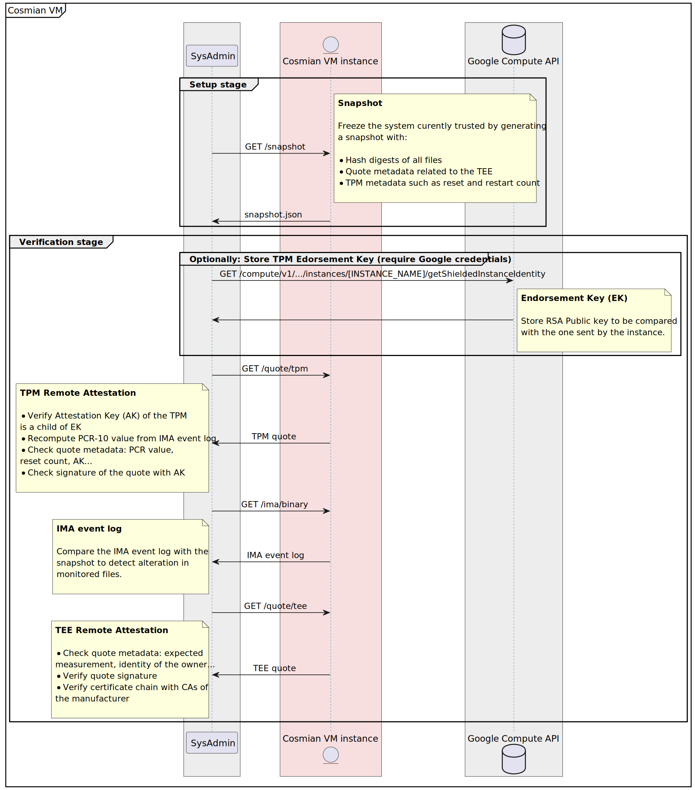

# Cosmian VM


_Cosmian VM_ are Linux-based system images preconfigured to verify Confidential VM trustworthiness and integrity at anytime.
The images are based either on Ubuntu 22.04 or RHEL 9, and can then be used as regular Linux distribution on most cloud providers such as Google Cloud Platform (GCP), Microsoft Azure and Amazon Web Services (AWS).

_Cosmian VM_ image provides the following features:

- **Confidentiality**: the whole environment runs in a Trusted Execution Environment (TEE) with encrypted memory
- **Verifiability**: user can verify the integrity of executables at any time and compare against a reference snapshot
- **Genericity**: compatible with AMD SEV-SNP and Intel TDX in addition to TPM and vTPM
- **No code modification**: no need for third party library or any specific adaptation of applications
- **Simplicity**: manual configuration reduced at its bare minimum

<p align="center">
  
</p>

> [!IMPORTANT]
> Threat Model: _Cosmian VM_ is designed to secure your application against passive (honest-but-curious) and active (malicious) cloud provider staff member

The foundation of _Cosmian VM_ relies on the following components:

- Trusted Execution Environment (TEE) such as AMD SEV-SNP or Intel TDX for memory encryption
- Trusted Platform Module (TPM) or vTPM (virtual TPM) to store secrets and attest the content of some memory region
- Integrity Measurement Architecture (IMA), a Linux kernel module used to maintain a measurement log of all executables

In addition, _Cosmian VM_ image contains the following software:

- `cosmian_vm_agent`: an agent running in the confidential VM to forward attestations, collaterals (e.g. root certificates) and measurement log
- `cosmian_certtool` to ease the generation of **Let's Encrypt** certificates if needed
- `cosmian_fstool` to ease the generation of LUKS container with secret key stored in the TPM/vTPM

Our client CLI [cosmian_vm](https://github.com/Cosmian/cosmian_vm/tree/main/crate/cli) can be used to interact with `cosmian_vm_agent` and verify the trustworthiness of a specific instance launched with _Cosmian VM_ as base image.

> [!IMPORTANT]
> Audit: _Cosmian VM_ image construction process can be found in this repository: [https://github.com/Cosmian/cosmian_vm/packer](https://github.com/Cosmian/cosmian_vm/tree/main/packer)

## Table of contents

<!-- toc -->

- [Setup flow](#setup-flow)
- [Snapshot of the system](#snapshot-of-the-system)
- [Verification of the remote instance](#verification-of-the-remote-instance)
- [Cloud providers support](#cloud-providers-support)
  * [Marketplace Image content](#marketplace-image-content)
  * [Configuration file](#configuration-file)
  * [First Cosmian VM launch](#first-cosmian-vm-launch)
  * [Handle Cosmian VM status](#handle-cosmian-vm-status)
  * [Usage](#usage)
  * [Provide secrets without SSH access](#provide-secrets-without-ssh-access)
- [Other Cosmian Products base on Cosmian VM](#other-cosmian-products-base-on-cosmian-vm)

<!-- tocstop -->

## Setup flow

A confidential VM is instantiated from a cloud provider platform, including Cosmian VM solution. After installing all dependencies, a snapshot of the VM is done and integrity checks can be performed on the running application, in order to verify the running code and infrastructure.

<p align="center">
  
</p>

## Snapshot of the system

The snapshot of the system is a crucial step performed by `cosmian_vm_agent` to produce a JSON file with:

- TEE policy
- TPM policy
- List of measured files and their hash digests

It's a one-time process done before you decide to freeze the system, the content will be compared with TEE attestation, TPM/vTPM attestation and IMA measurement log to verify the trustworthiness of the remote instance.

## Verification of the remote instance

Verification process of the Cosmian VM is performed using client CLI [cosmian_vm](https://github.com/Cosmian/cosmian_vm/tree/main/crate/cli) which will check:

- IMA (Integrity Measurement Architecture) measurement log with the list of executable and configuration file's hash digest, to be compared against the snapshot
- TPM (Trusted Platform Module) attestation of the IMA measurement log
- TEE (Trusted Execution Environment) trustworthiness to ensure the instance is running on secure hardware using encrypted memory

<p align="center">
  
</p>

## Cloud providers support

_Cosmian VM_ already supports AMD SEV-SNP and Intel TDX but it might depend on the cloud provider.

Here is a list of compatibility as of March 2024:

|           |           GCP           |          Azure          |      AWS      |
| :-------- | :---------------------: | :---------------------: | :-----------: |
| Intel TDX |      Ubuntu 22.04       |      Ubuntu 22.04       | Not available |
| AMD SEV   | Ubuntu 22.04<br/>RHEL 9 | Ubuntu 22.04<br/>RHEL 9 | Ubuntu 22.04  |

### Marketplace Image content

The Cosmian VM image build on the marketplaces of GCP, Azure or AWS contains four major executables:

- `cosmian_vm_agent` is designed to be deployed on the Cosmian VM. It serves on demand the collaterals used to verify the trustworthiness of the Cosmian VM such as the IMA file, the TEE quote or the TPM quote
- `cosmian_certtool` is designed to generate a certificate signed by _Let's Encrypt_ or an RATLS certificate
- `cosmian_fstool` is designed to generate a LUKS container and enroll the TPM to be automatically started on reboot
- `cosmian_vm` is a CLI designed to be used on your own host. It queries the `cosmian_vm_agent` in order to get the collaterals used to verify the trustworthiness of the Cosmian VM

This image:

- contains the fully configured IMA
- contains the fully configured SELinux
- disables the auto-update (to avoid any modification of the Cosmian VM after having snapshoted it)
- contains the fully configured `cosmian_vm_agent`

This is a abstract of the updated file tree:

```console
.
├── etc
│   ├── apt
│   │    └── apt.conf.d
│   │       └── 10periodic
│   ├── cosmian_vm
│   │   └── agent.toml
│   ├── default
│   │   └── grub
│   ├── ima
│   │   └── ima-policy
│   └── systemd
│       └── system
│           └── cosmian_vm_agent.service
├── usr
│   └── sbin
│       ├── cosmian_certtool
│       ├── cosmian_fstool
│       └── cosmian_vm_agent
└── var
    └── lib
        └── cosmian_vm
            ├── container   <--- LUKS container
            ├── tmp
            └── data        <--- LUKS container mounted
                ├── cert.pem
                └── cert.key
```

### Configuration file

The Cosmian VM Agent relies on a configuration file located at `/etc/cosmian_vm/agent.toml`. Feel free to edit it.
A minimal configuration file is:

```toml
[agent]
host = "127.0.0.1"
port = 5555
ssl_certificate = "data/cert.pem"
ssl_private_key = "data/key.pem"
tpm_device = "/dev/tpmrm0"
```

You can change the default location of the configuration file by setting the environment variable: `COSMIAN_VM_AGENT_CONF`.

### First Cosmian VM launch

When `cosmian_vm_agent` starts for the first time, it initializes several components:

1. It generates a self-signed certificate and set the `CommonName` of the certificate to the value of the machine hostname.
2. It generates a LUKS container (`/var/lib/cosmian_vm/container`) and mounted it at `/var/lib/cosmian_vm/data`. Note that,
   `/var/lib/cosmian_vm/tmp` is a `tmpfs`. It is encrypted but it should contains only volatile data since it is erased at each VM reboot. Data in this directory is encrypted due to the fact that the RAM is encrypted.
3. It generates the TPM endorsement keys

It is recommended to configure 1. and 2. on your own for production systems.

The certificate can be changed at will:

- Edit your DNS register to point to that VM
- Create a trusted certificate using the method of your choice (_Let's encrypt_ for instance) or use `cosmian_certtool`
- Edit the `cosmian_vm_agent` configuration file to point to the location of the TLS certificate and private key.

The LUKS container can be regenerated using `cosmian_fstool` with your own size and password (to store by yourself in a secure location). It is recommended to use an additional backup disk to store the container.

You can skip all these first startup steps by setting `COSMIAN_VM_PREINIT=0` when starting `cosmian_vm_agent`.

### Handle Cosmian VM status

Once the image instantiated (on GCP, Azure or AWS), the `cosmian_vm_agent` automatically starts as a `systemd` service when the VM boots.

You can now install any packages or applications you want on the VM.

Your VM is now set and ready.

### Usage

Then on your localhost, when you are sure your VM is fully configured and should not change anymore:

1. Create a snapshot (once)

```sh
cosmian_vm --url https://my_app.dev snapshot
```

You can process only one snapshot at a time.

2. Verify the current state of the machine

```sh
cosmian_vm --url https://my_app.dev verify --snapshot cosmian_vm.snapshot
```

If you use the default Cosmian VM setup relying on a self-signed certificate, you need to add the argument: `--allow-insecure-tls` as follow:

```sh
cosmian_vm --url https://my_app.dev --allow-insecure-tls snapshot
```

When verifying a Cosmian VM you can also check that the TLS certificate of services installed inside this VM are the one used when querying the Cosmian VM Agent during the verification. To do so use `--application` (as many times as you want) as follow:

```sh
cosmian_vm --url https://my_app.dev verify --snapshot cosmian_vm.snapshot \
                                           --application service1.cosmian.dev:3655 \
                                           --application service2.cosmian.dev
```

### Provide secrets without SSH access

A user who does not have a SSH access can still securely send secrets to the Cosmian VM Agent that are written in the encrypted Cosmian mount point.

> [!IMPORTANT]
> Indeed the Cosmian VM CLI can be used to remotely:
>
> - start, stop or restart your application service (installed as a `systemd` or `supervisor` service),
> - send secrets, password, keys etc. directly to the Cosmian VM Agent through the TLS connection of the `cosmian_vm_agent` server without SSH access.
>
> Furthermore, these secrets are stored in the Cosmian LUKS mount point.

As a prerequisite, before snapshotting the Cosmian VM, you must connect to the Cosmian VM instance via SSH and configure the `app` section in the `agent.toml` as follow:

```toml
[agent]
host = "0.0.0.0"
port = 5555
ssl_certificate = "data/my_app.dev/cert.pem"
ssl_private_key = "data/my_app.dev/key.pem"
tpm_device = "/dev/tpmrm0"

[app]
service_type = "systemd"
service_name = "my_app"
app_storage = "data/app"
```

> [!TIP]
> The field `app_storage` defined the directory containing the configuration data of your application or any data used by the application. It is recommended to store it inside the Cosmian VM encrypted folder: `/var/lib/cosmian_vm/data`.

From here, restart the Cosmian VM Agent:

```sh
sudo systemctl restart cosmian_vm_agent
```

Then, you can provide the app configuration file from your localhost to the Cosmian VM Agent as follow:

```sh
cosmian_vm --url https://my_app.dev app init --conf app.json
```

where `app.json` is the configuration file that the application expects. A JSON file here for example.

It will be send to the `cosmian_vm_agent` and stored in the LUKS container in `/var/lib/cosmian_vm/data/app/app.conf`.

> [!NOTE]
> `data/app/` subpath is provided as `app_storage` variable by `agent.toml` configuration.

If you call again `init` the previous configuration file is overwritten.

The `restart` subcommand can restart the application identified in `service_name` field.

```sh
cosmian_vm --url https://my_app.dev app restart
```

## Other Cosmian Products base on Cosmian VM

| Cosmian VM | Cosmian KMS | Cosmian AI Runner |
| ---------- | ----------- | ----------------- |
| 1.2.1      | 4.16.0      | 0.3.0             |
| 1.2.0      | 4.16.0      | -                 |
| 1.1.2      | 4.15.0      | -                 |
