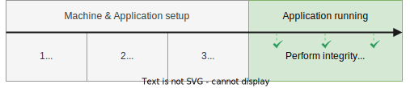
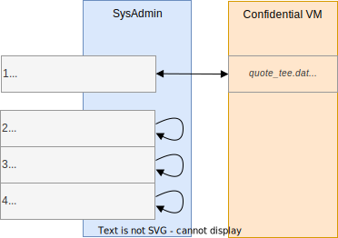

# Cosmian VM

Cosmian VM allows you to deploy an application on a cloud provider instance, running in a confidential context with verifiability at any time.

- **No binary modification**: the application doesn't need any third party library or any specific adaptation
- **Simplicity is gold**: reduce at its minimum the number of manual actions the user has to do to spawn a Cosmian VM
- **Confidentiality**: the application runs in a Trusted Execution Environment (encrypted memory)
- **Verifiability**: a user is able to verify the integrity of the system (OS & application) at any time

<p align="center">
  
</p>

💡 You can find a more complete documentation here:  [https://docs.cosmian.com](https://docs.cosmian.com/compute/cosmian_vm/overview/) 

# Table of contents

<!-- toc -->

- [Setup flow](#setup-flow)
- [Verification steps](#verification-steps)
- [Coverage](#coverage)
- [Compile and run tests](#compile-and-run-tests)
- [Build a Cosmian VM image for SEV/TDX](#build-a-cosmian-vm-image-for-sevtdx)
- [Start a Cosmian VM on SEV/TDX](#start-a-cosmian-vm-on-sevtdx)
- [Usage](#usage)
- [Provide secrets](#provide-secrets)
- [How to use Cosmian VM on SGX](#how-to-use-cosmian-vm-on-sgx)

<!-- tocstop -->

## Setup flow

A confidential VM is instantiated from a cloud provider platform, including Cosmian VM solution. After installing all dependencies, a snapshot of the VM is done and integrity checks can be performed on the running application, in order to verify the running code and infrastructure.

<p align="center">
  
</p>

## Verification steps

Cosmian verification process is performed by the sys admin, requesting on the running confidential VM, and checks:

- IMA measurement list (containing the list of executed file's hash digest)
- TEE (Trusted Execution Environment) elements to provide assurance that the code is running on secure and confidential hardware
- TPM (Trusted Platform Module) elements to attest a TEE and the integrity of the system (IMA)

<p align="center">
  
</p>

## Coverage

Cosmian VM supports these kinds of TEE:

- Intel SGX on OVH - Ubuntu 20.04 & 22.04
- Intel TDX on GCP - Ubuntu 22.04
- AMD SEV on GCP - Ubuntu 22.04 | RHEL 9 and AWS - AmazonLinux

## Compile and run tests

The Cosmian VM contains four major executables:

- `cosmian_vm_agent` is designed to be deployed on the Cosmian VM. It serves on demand the collaterals used to verify the trustworthiness of the Cosmian VM such as the IMA file, the TEE quote or the TPM quote
- `cosmian_certtool` is designed to generate a certificate signed by *Let's Encrypt* or an RATLS certificate
- `cosmian_fstool` is designed to generate a luks container and enroll the TPM to be automatically started on reboot
- `cosmian_vm` is a CLI designed to be used on your own host. It queries the `cosmian_vm_agent` in order to get the collaterals used to verify the trustworthiness of the Cosmian VM

You can compile and test these both binaries as follow:

```sh
sudo apt install libssl-dev libtss2-dev
cargo build
cargo test
```

## Build a Cosmian VM image for SEV/TDX

A Cosmian VM image containing a full configured environment can be built as follow:

```sh
cargo build
cp target/debug/cosmian_vm_agent packer
cd packer
# Create a service account on GCP and download the JSON file
# https://console.cloud.google.com/iam-admin/serviceaccounts?cloudshell=false&project=MY_PROJECT
export GOOGLE_APPLICATION_CREDENTIALS="/home/user/my-project-d42061429e6a.json"
packer build gcp.pkr.hcl
```

The images are also automatically built by the CI when pushing on main or when releasing a tag.

This image:

- contains the fully configured IMA
- contains the fully configured SELinux
- disables the auto-update (to avoid any modification of the Cosmian VM after having snapshoted it)
- contains the fully configured `cosmian_vm_agent`

This is a abstract of the updated file tree:

```
.
├── etc
│   ├── apt
│   │    └── apt.conf.d
│   │       └── 10periodic
│   ├── cosmian_vm
│   │   └── agent.toml
│   ├── default
│   │   └── grub
│   ├── ima
│   │   └── ima-policy
│   └── supervisor
│       ├── supervisord.conf
│       └── conf.d
│           └── cosmian_vm_agent.conf
├── mnt
│   └── cosmian_vm
│       └── data
├── usr
│   └── sbin
│       ├── cosmian_certtool
│       ├── cosmian_fstool
│       └── cosmian_vm_agent
└── var
    ├── lib
    │   └── cosmian_vm
    │       ├── container
    │       ├── tmp
    │       └── data
    │           ├── cert.pem
    │           └── cert.key
    └── log
        └── cosmian_vm
            ├── agent.err.log
            └── agent.out.log
```

## Configuration file

The Cosmian VM Agent relies on a configuration file located at `/etc/cosmian_vm/agent.toml`. Feel free to edit it.
A minimal configuration file is:

```toml
[agent]
data_storage = "/var/lib/cosmian_vm/"
host = "127.0.0.1"
port = 5355
ssl_certificate = "data/cert.pem"
ssl_private_key = "data/key.pem"
tpm_device = "/dev/tpmrm0
```

You can change the default location of the configuration file by setting the environment variable: `COSMIAN_VM_AGENT_CONF`.

## First Cosmian VM launch

When `cosmian_vm_agent` starts for the first time, it initializes several components:

1. It generates a self-signed certificate and set the `CommonName` of the certificate to the value of the machine hostname.
2. It generates a luks container (`/var/lig/cosmian_vm/container`) and mounted it at `/var/lig/cosmian_vm/data`. Note that,
`/var/lib/cosmian_vm/tmp` is a tmpfs. It is encrypted but it should contains only volatile data since it is erased at each VM reboot. Data in this directory is encrypted due to the fact that the RAM is encrypted.
3. It generates the TPM endorsement keys

It is recommended to configure 1. and 2. on your own for production systems. 

The certificate can be changed at will:
- Edit your DNS register to point to that VM
- Create a trusted certificate using the method of your choice (*Let's encrypt* for instance) or use `cosmian_certtool`
- Edit the `cosmian_vm_agent` configuration file to point to the location of the TLS certificate and private key.

The luks container can be regenerated using `cosmian_fstool` with your own size and password (to store by yourself in a secure location). It is recommended to use an additional backup disk to store the container. 

## Start a Cosmian VM on SEV/TDX

Now, instantiate a VM based on the built image. The `cosmina_vm_agent` automatically starts when the VM boots.

You can start/restart/stop the Cosmian VM Agent as follow:

```sh
# If the surpervisor configuration file has been edited, reload it first
supervisorctl reload cosmian_vm_agent
supervisorctl start cosmian_vm_agent
# Or
supervisorctl restart cosmian_vm_agent
# Or
supervisorctl stop cosmian_vm_agent
 ```

You can now install any packages or applications you want on the VM.

Your VM is now set and ready.

## Usage

Then on your localhost, when you are sure your VM is fully configured and should not change anymore:

1. Create a snapshot (once)

```sh
cosmian_vm --url https://cosmianvm.cosmian.dev snapshot
```

You can process only one snapshot at a time. 

2. Verify the current state of the machine

```sh
cosmian_vm --url https://cosmianvm.cosmian.dev verify --snapshot cosmian_vm.snapshot
```

If you use the default Cosmian VM setup relying on a self-signed certificate, you need to add the argument: `--allow-insecure-tls` as follow:

```sh
cosmian_vm --url https://cosmianvm.cosmian.dev --allow-insecure-tls snapshot
```

When verifying a Cosmian VM you can also check that the TLS certificate of services installed inside this VM are the one used when querying the Cosmian VM Agent during the verification. To do so use `--application` (as many times as you want) as follow:

```sh
$ cosmian_vm --url https://cosmianvm.cosmian.dev verify --snapshot cosmian_vm.snapshot \
                                                        --application service1.cosmian.dev:3655 \
                                                        --application service2.cosmian.dev
```

## Provide secrets

Before snapshotting the Cosmian VM, you can also provide a secret/configuration file to an application running inside the Cosmian VM. It can be relevant if the secrets provisionning is made by someone who doesn't have the rights to connect to the VM through SSH for instance. 

Prior to send the secrets, you should have configured the `app` section in the `agent.toml` as follow:

```toml
[agent]
data_storage = "/var/lib/cosmian_vm/"
host = "0.0.0.0"
port = 5355
ssl_certificate = "data/cosmianvm.cosmian.dev/cert.pem"
ssl_private_key = "data/cosmianvm.cosmian.dev/key.pem"
tpm_device = "/dev/tpmrm0"

[app]
service_type = "supervisor"
service_name = "cosmian_helloworld"
app_storage = "data/app"
```

In that example, [`cosmian_helloworld`](https://github.com/Cosmian/helloworld-service) is the name of the application (as a `supervisor` service).

The field `app_storage` defined the directory containing the configuration data of your application or any data used by the application. It is recommended to store it inside the Cosmian VM encrypted folder: `/var/lib/cosmian_vm/data`.

Now, you can provide the app configuration file from your localhost to the Cosmian VM as follow:

```sh
cosmian_vm --url https://cosmianvm.cosmian.dev app init --conf app.json
```

The configuration file can be anything the application expects. Here, a json file. It will be send to the `cosmian_vm_agent` and stored in the luks container in `/var/lib/cosmian_vm/data/app/app.conf`.

If you call again `init` the previous configuration file is overwritten.

The `restart` subcommand can restart the application identified in `service_name` field.

## How to use Cosmian VM on SGX

See [`how to use cosmian VM on SGX`](resources/sgx/README.md)
