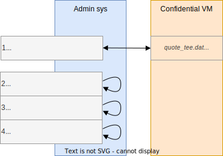

# Cosmian VM

Cosmian VM allows you to deploy an application on a cloud provider instance, running in a confidential context with verifiability at any time.

- No binary modification: the application doesn’t need any third party library or any specific adaptation
- Simplicity is gold: reduce at its minimum the number of manual actions the user has to do to spawn a Cosmian VM
- Confidentiality: the application runs in a Trusted Execution Environment (encrypted memory)
- Verifiability: a user is able to verify the integrity of the system (OS & application) at any time

## Setup flow

A confidential VM is instanciated from a cloud provider platform, including Cosmian VM solution. After installing all dependencies, the VM is snapshotted and integrity checks can be performed on the running application, in order to verify the running code and infrastructure.

<p align="center">
  
</p>

## Verification steps

Cosmian verification process is performed by the admin sys, requesting on the running confidential VM, and checks:

- IMA measurement list (containing the list of executed file's hash digest)
- TEE (Trusted Execution Environment) elements to provide assurance that the code is running on secure and confidential hardware
- TPM (Trusted Platform Module) elements to attest a TEE and the integrity of the system (IMA)

<p align="center">
  
</p>

## Coverage

Cosmian VM supports these kinds of TEE:
- Intel SGX
- Intel TDX
- AMD SEV

## Setup a Cosmian VM

A Cosmian VM image containing a full configured environment can be built as follow:

```sh
$ cd packer
$ packer build gcp.pkr.hcl
```

This image:
- contains the fully configured IMA
- contains the fully configured SELinux 
- disable the auto-update (to avoid any modification of the Cosmian VM after having snapshoted it)
- contains the fully configured `cosmian_vm_agent` and a nginx to redirect queries to it
- contains a script `cosmian_vm_post_install.sh` to finalize the configuration of the Cosmian VM after installing the image on a fresh environment. It will setup the SSL certificate and finalize the configuration of the nginx & `cosmian_vm_agent`

## Compile

```sh
$ cargo build
$ cargo test
```

## Usage

On a configured SEV/TDX host, create and edit the `cosmian_vm_agent` configuration file located at `/etc/cosmian_vm/agent.conf`. 
A minimal configuration file is:

```toml
[agent]
pem_certificate = "/etc/letsencrypt/live/cosmianvm.cosmian.dev/cert.pem"
```

Then, run the  `cosmian_vm_agent` as follow:

```sh  
$ sudo ./cosmian_vm_agent
```

Then on your localhost:

1. Create a snapshot (once)
   
```sh
$ cosmian_vm snapshot --url https://cosmianvm.cosmian.dev
```

2. Verify the current state of the machine

```sh
$ cosmian_vm verify --url https://cosmianvm.cosmian.dev --snapshot cosmian_vm.snapshot  
```

## Provide secrets

You can also provide a secret file to an application running inside the `cosmian_vm`. 

Prio to send the secrets, you should have configured the  `app` section in the `agent.conf` as follow:

```toml
[agent]
pem_certificate = "/etc/letsencrypt/live/cosmianvm.cosmian.dev/cert.pem"

[app]
service_app_name = "cosmian_helloworld"
decrypted_folder = "/mnt/cosmian_vm/data"
encrypted_secret_app_conf = "/etc/cosmian_vm/app_secrets.json"
```

In that example, `cosmian_helloworld` is the name of the application (as a service). 
- `decrypted_folder` stands for the directory where the application expects to find its decrypted configuration file (which should be located into an encrypted RAMFS)
- `encrypted_secret_app_conf` stands for the location where `cosmian_vm_agent` store the application configuration encrypted

Now, you can provide the secret file from your localhost to the Cosmian VM as follow:

```sh
$ cosmian_vm app init --url https://cosmianvm.cosmian.dev --conf secrets.json
```

The configuration file can be anything the application expects. Here, a json file. 

The configuration file will be encrypted by the `cosmian_vm_agent` and stored encrypted in the value set in `encrypted_secret_app_conf`. 
A decrypted version of this file will be saved in the value set in `decrypted_folder`. The `init` subcommand will finally start the application identified in `service_app_name` field. 

The key used to encrypt this file will be prompted in the output of the `init` command if you don't provide it as an args of the command using `--key`.

If you call again `init` the previous secrets file is overwritten. 

Note that `cosmian_vm_agent` won't save the key on its side. Therefore, in the event of a reboot, you need to provide the key to decrypt the secrets. To do so, use: 

```sh
$ cosmian_vm app restart --url https://cosmianvm.cosmian.dev --key abcdefghij0123456789abcdefghij0123456789abcdefghij0123456789
```

The `restart` subcommand will finally start the application identified in `service_app_name` field. 