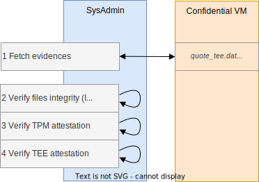

# Cosmian VM

Cosmian VM allows you to deploy an application on a cloud provider instance, running in a confidential context with verifiability at any time.

- **No binary modification**: the application doesn't need any third party library or any specific adaptation
- **Simplicity is gold**: reduce at its minimum the number of manual actions the user has to do to spawn a Cosmian VM
- **Confidentiality**: the application runs in a Trusted Execution Environment (encrypted memory)
- **Verifiability**: a user is able to verify the integrity of the system (OS & application) at any time

<p align="center">
  
</p>

## Setup flow

A confidential VM is instantiated from a cloud provider platform, including Cosmian VM solution. After installing all dependencies, a snapshot of the VM is done and integrity checks can be performed on the running application, in order to verify the running code and infrastructure.

<p align="center">
  
</p>

## Verification steps

Cosmian verification process is performed by the sys admin, requesting on the running confidential VM, and checks:

- IMA measurement list (containing the list of executed file's hash digest)
- TEE (Trusted Execution Environment) elements to provide assurance that the code is running on secure and confidential hardware
- TPM (Trusted Platform Module) elements to attest a TEE and the integrity of the system (IMA)

<p align="center">
  
</p>

## Coverage

Cosmian VM supports these kinds of TEE:

- Intel SGX
- Intel TDX
- AMD SEV

## Compile and run tests

The Cosmian VM contains three majors binaries:

- `cosmian_vm_agent` is designed to be deployed on the Cosmian VM. It serves on demand the collaterals used to verify the trustworthiness of the Cosmian VM such as the IMA file, the TEE quote or the TPM quote
- `cosmian_certtool` is designed to generate a certificate signed by *Let's Encrypt* or an RATLS certificate
- `cosmian_vm` is a CLI designed to be used on your own host. It queries the `cosmian_vm_agent` in order to get the collaterals used to verify the trustworthiness of the Cosmian VM

You can compile and test these both binaries as follow:

```sh
sudo apt install libssl-dev libtss2-dev
cargo build
cargo test
```

## Build a Cosmian VM image for SEV/TDX

A Cosmian VM image containing a full configured environment can be built as follow:

```sh
cargo build
cp target/debug/cosmian_vm_agent packer
cd packer
# Create a service account on GCP and download the JSON file
# https://console.cloud.google.com/iam-admin/serviceaccounts?cloudshell=false&project=MY_PROJECT
export GOOGLE_APPLICATION_CREDENTIALS="/home/user/my-project-d42061429e6a.json"
packer build gcp.pkr.hcl
```

This image:

- contains the fully configured IMA
- contains the fully configured SELinux
- disables the auto-update (to avoid any modification of the Cosmian VM after having snapshoted it)
- contains the fully configured `cosmian_vm_agent`

This is a abstract of the updated file tree:

```c
.
├── etc
│   ├── apt
│   │    └── apt.conf.d
│   │       └── 10periodic
│   ├── cosmian_vm
│   │   ├── agent.toml
│   │   ├── cert.pem
│   │   └── cert.key
│   ├── default
│   │   └── grub
│   ├── ima
│   │   └── ima-policy
│   └── supervisor
│       ├── supervisord.conf
│       └── conf.d
│           └── cosmian_vm_agent.conf
├── mnt
│   └── cosmian_vm
│       └── data
├── usr
│   └── sbin
│       ├── cosmian_certtool
│       └── cosmian_vm_agent
└── var
    └── log
        └── cosmian_vm
            ├── agent.err.log
            └── agent.out.log
```

## Start a Cosmian VM on SEV/TDX

Now, instantiate a VM based on the built image.

On a fresh installation, the `cosmian_vm_agent` uses a self-signed certificate generated at the start of the service and set the `CommonName` of the certificate to the value of the machine hostname.

You can change that at will:

- Edit your DNS register to point to that VM
- Create a trusted certificate using the method of your choice (*Let's encrypt* for instance)
- Edit the `cosmian_vm_agent` configuration file to point to the location of the TLS certificate and private key.

The Cosmian VM Agent relies on a configuration file located at `/etc/cosmian_vm/agent.toml`. Feel free to edit it.
A minimal configuration file is:

```toml
[agent]
host = "127.0.0.1"
port = 5355
ssl_certificate = "/etc/cosmian_vm/cert.pem"
ssl_private_key = "/etc/cosmian_vm/key.pem"
tpm_device = "/dev/tpmrm0
```

You can change the default location of the configuration file by setting the environment variable: `COSMIAN_VM_AGENT_CONF`.

Note, that you can start/restart/stop the Cosmian VM Agent as follow:

```sh
# If the surpervisor configuration file has been edited, reload it first
supervisorctl reload cosmian_vm_agent
supervisorctl start cosmian_vm_agent
# Or
supervisorctl restart cosmian_vm_agent
# Or
supervisorctl stop cosmian_vm_agent
 ```

You can now install any packages or applications you want on the VM.

Your VM is now set and ready.

## Usage

Then on your localhost, when you are sure your VM is fully configured and should not change anymore:

1. Create a snapshot (once)

```sh
cosmian_vm --url https://cosmianvm.cosmian.dev snapshot
```

You can process only one snapshot at a time. 

2. Verify the current state of the machine

```sh
cosmian_vm --url https://cosmianvm.cosmian.dev verify --snapshot cosmian_vm.snapshot
```

If you use the default Cosmian VM setup relying on a self-signed certificate, you need to add the argument: `--allow-insecure-tls` as follow:

```sh
cosmian_vm --url https://cosmianvm.cosmian.dev --allow-insecure-tls snapshot
```

When verifying a Cosmian VM you can also check that the TLS certificate of services installed inside this VM are the one used when querying the Cosmian VM Agent during the verification. To do so use `--application` (as many times as you want) as follow:

```sh
$ cosmian_vm --url https://cosmianvm.cosmian.dev verify --snapshot cosmian_vm.snapshot \
                                                        --application service1.cosmian.dev:3655 \
                                                        --application service2.cosmian.dev
```

## Provide secrets

Before snapshotting the Cosmian VM, you can also provide a secret file to an application running inside the Cosmian VM.

Prior to send the secrets, you should have configured the  `app` section in the `agent.toml` as follow:

```toml
[agent]
host = "0.0.0.0"
port = 5355
ssl_certificate = "/etc/letsencrypt/live/cosmianvm.cosmian.dev/cert.pem"
ssl_private_key = "/etc/letsencrypt/live/cosmianvm.cosmian.dev/key.pem"
tpm_device = "/dev/tpmrm0"

[app]
service_type = "supervisor"
service_app_name = "cosmian_helloworld"
decrypted_folder = "/mnt/cosmian_vm/data"
encrypted_secret_app_conf = "/etc/cosmian_vm/app_secrets.json"
```

In that example, [`cosmian_helloworld`](https://github.com/Cosmian/helloworld-service) is the name of the application (as a `supervisor` service).

- `decrypted_folder` stands for the directory where the application expects to find its decrypted configuration file (which should be located into an encrypted RAMFS)
- `encrypted_secret_app_conf` stands for the location where `cosmian_vm_agent` stores the application configuration encrypted

Note that the Cosmian VM is configured with a tmpfs directory: `/mnt/cosmian_vm/data` (size=512MB). The application can put volatile data in it. Data in this directory is encrypted due to the fact that the RAM is encrypted.
If you change the value of `decrypted_folder`, make sure to create a tmpfs to keep the encryption property of the data located in it.

Now, you can provide the secret file from your localhost to the Cosmian VM as follow:

```sh
cosmian_vm --url https://cosmianvm.cosmian.dev app init --conf secrets.json
```

The configuration file can be anything the application expects. Here, a json file.

The configuration file will be encrypted by the `cosmian_vm_agent` and stored encrypted in the value set in `encrypted_secret_app_conf`.
A decrypted version of this file will be saved in the value set in `decrypted_folder`. The `init` subcommand will finally start the application identified in `service_app_name` field.

The key used to encrypt this file will be prompted in the output of the `init` command if you don't provide it as an arg of the command using `--key`.

If you call again `init` the previous secrets file is overwritten.

Note that `cosmian_vm_agent` won't save the key on its side. Therefore, in the event of a reboot, you need to provide the key to decrypt the secrets. To do so, use:

```sh
cosmian_vm --url https://cosmianvm.cosmian.dev app restart --key abcdefghij0123456789abcdefghij0123456789abcdefghij0123456789
```

The `restart` subcommand will finally start the application identified in `service_app_name` field.

## How to use Cosmian VM on SGX

See [`how to use cosmian VM on SGX`](resources/sgx/README.md)
