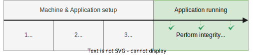
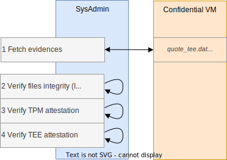
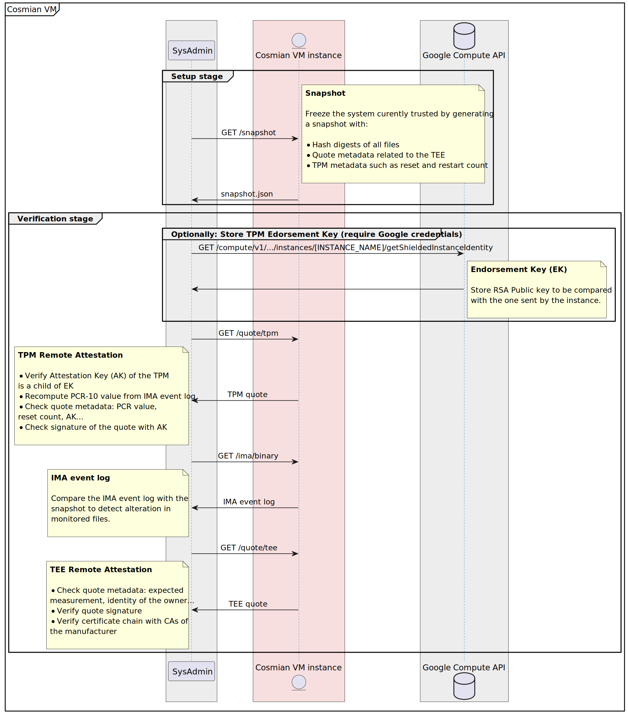

# Cosmian VM

Cosmian VM offers:

- a hardened pre-configured Linux distribution (based on Ubuntu 22.04 or RHEL 9) with LUKS disk encryption designed for confidential computing machines.
- a seamless, unique experience across all confidential hardware (Intel TDX, AMD SEV-SNP, soon NVIDIA H100) and cloud providers (AWS, Azure, GCP)
- an extended verifiability of the hardware, OS, and binaries running on the VM.

Specifically, the Cosmian VM provides the following features:

- **Confidentiality**: the whole environment runs in a Trusted Execution Environment (TEE) with encrypted memory on top of encrypted storage.
- **Verifiability**: the user can verify the integrity of the hardware, OS, and executables at any time and compare them against a reference snapshot
- **Genericity**: compatible with AMD SEV-SNP, Intel TDX, and TPM or vTPM. Works identically on all cloud providers.
- **No code modification**: no third-party library or any change to applications
- **Simplicity**: manual configuration is reduced to the bare minimum. A Linux administrator enjoys the same experience as that of a standard VM.

## Use cases

Cosmian VM is used in these two scenarios:

- Quickly migrate an on-premise application to the public cloud without modifications while running it with the same level of confidentiality, e.g., migrating an HR application to the cloud.
- offer confidential SaaS services to your customers/users, protecting their privacy against the cloud provider and any extra-territorial law, e.g., offering confidential AI/Gen. AI in the public cloud.

<p align="center">
  
</p>

!!! info "Threat Model"

    *Cosmian VM* is designed to secure your application against passive (honest-but-curious) and active (malicious) cloud provider staff member

## Extended Verifiability

Cosmian VM provides memory and disk encryption on a hardened system and extends the hardware remote attestation supplied by Intel and AMD to the verifiability of the operating system,
as well as the binary files or other files marked as verifiable on the system.
A user can quickly check the integrity of the whole system (no hardware change, no OS change, known binaries running or having run) before sending sensitive data for processing.

To do this, Cosmian VM builds on the following components:

- Trusted Execution Environment (TEE) such as AMD SEV-SNP or Intel TDX for memory encryption
- Trusted Platform Module (TPM) or vTPM (virtual TPM) to store secrets and attest the content of some memory region
- Integrity Measurement Architecture (IMA), a Linux kernel module used to maintain a measurement log of all executables

To securely tie these components together, Cosmian VM image contains the following software:

- `cosmian_vm_agent`: an agent running in the confidential VM to forward attestations, collaterals (e.g. root certificates) and measurement log
- `cosmian_certtool` to ease the generation of _Let's Encrypt_ certificates if needed
- `cosmian_fstool` to ease the generation of LUKS container with the secret key stored in the TPM/vTPM (automount on reboot)

Our client CLI [cosmian_vm](https://github.com/Cosmian/cosmian_vm/tree/main/crate/cli) can be used to interact with `cosmian_vm_agent` and verify the trustworthiness of a specific instance launched with Cosmian VM as base image.

!!! info "Audit"

    *Cosmian VM* image construction process can be found in this repository: [https://github.com/Cosmian/cosmian_vm/packer](https://github.com/Cosmian/cosmian_vm/packer)

## Usage

<!-- toc -->

- [Cosmian VM](#cosmian-vm)
  - [Use cases](#use-cases)
  - [Extended Verifiability](#extended-verifiability)
  - [Usage](#usage)
  - [Setup flow](#setup-flow)
  - [Snapshot of the system](#snapshot-of-the-system)
  - [Verification of the remote instance](#verification-of-the-remote-instance)
  - [Cloud providers support](#cloud-providers-support)
    - [AWS images](#aws-images)
    - [Azure images](#azure-images)
    - [GCP images](#gcp-images)
    - [Marketplace Image content](#marketplace-image-content)

<!-- tocstop -->

## Setup flow

A Cosmian VM is instantiated from a [cloud provider marketplace](https://cosmian.com/marketplace/) on top of a confidential computing machine.
Once the system administrator has installed the application and its dependencies, a snapshot of the VM is taken. Integrity checks can then be performed on the running VM to verify the running code, OS, and hardware.

<p align="center">
  
</p>

## Snapshot of the system

The snapshot of the system is a crucial step performed by `cosmian_vm_agent` to produce a JSON file with:

- TEE policy
- TPM policy
- List of measured files and their hash digests

It's a one-time process that is done before you decide to freeze the instance and expect no more modification.

The content will be compared against TEE attestation, TPM/vTPM attestation and IMA measurement log to verify the trustworthiness of the remote instance.

## Verification of the remote instance

The verification process of the Cosmian VM is performed using client CLI [cosmian_vm](https://github.com/Cosmian/cosmian_vm/tree/main/crate/cli), which will check:

- IMA (Integrity Measurement Architecture) measurement log with the list of executable and configuration file's hash digest, to be compared against the snapshot
- TPM (Trusted Platform Module) attestation of the IMA measurement log
- TEE (Trusted Execution Environment) attestation to ensure the instance is running on secure hardware with encrypted memory

The verification is successful if files in IMA measurement log and snapshot have the same hash digests, TPM or vTPM correctly attested the IMA measurement log content and finally if TEE attestation is valid.

=== "Flow"

    <p align="center">
        
    </p>

=== "Detailed flow"

    <p align="center">
        
    </p>

## Cloud providers support

_Cosmian VM_ already supports AMD SEV-SNP and Intel TDX but it might depend on the cloud provider.

### AWS images

|               |                            Official image                            | OS image | OS version | Kernel version               | Cosmian base image          |
| :------------ | :------------------------------------------------------------------: | :------: | ---------- | ---------------------------- | --------------------------- |
| AWS - AMD SEV | ubuntu/images/hvm-ssd-gp3/ubuntu-noble-24.04-amd64-server-20250610|  Ubuntu  | 24.04      | 6.8.0-1016-aws               | base-image-X-Y-Z-ubuntu-sev |
| AWS - AMD SEV |          RHEL-9.4.0_HVM-20250519-x86_64-0-Hourly2-GP3             |  Redhat  | 9.4        | 5.14.0-427.37.1.el9_4.x86_64 | base-image-X-Y-Z-ubuntu-sev |

### Azure images

|                   |         Official image         | OS image | OS version | Kernel version               | Cosmian base image    | Version |
| :---------------- | :----------------------------: | :------: | ---------- | ---------------------------- | --------------------- | ------- |
| Azure - Intel TDX | Canonical-ubuntu-24_04-lts-cvm |  Ubuntu  | 24.04      | 6.8.0-1020-azure             | base-image-ubuntu-tdx | X.Y.Z   |
| Azure - AMD SEV   | Canonical-ubuntu-24_04-lts-cvm |  Ubuntu  | 24.04      | 6.8.0-1020-azure             | base-image-ubuntu-sev | X.Y.Z   |
| Azure - Intel TDX |    Redhat-rhel-cvm-9_4_cvm     |  Redhat  | 9.4        | 5.14.0-427.37.1.el9_4.x86_64 | base-image-rhel-tdx   | X.Y.Z   |
| Azure - AMD SEV   |    Redhat-rhel-cvm-9_4_cvm     |  Redhat  | 9.4        | 5.14.0-427.37.1.el9_4.x86_64 | base-image-rhel-sev   | X.Y.Z   |

### GCP images

|                 |          Official image           | OS image | OS version | Kernel version              | Cosmian base image          |
| :-------------- | :-------------------------------: | :------: | ---------- | --------------------------- | --------------------------- |
| GCP - Intel TDX | ubuntu-2404-noble-amd64-v20251021 |  Ubuntu  | 24.04      | 6.14.0-1017-gcp             | base-image-X-Y-Z-ubuntu-tdx |
| GCP - AMD SEV   | ubuntu-2404-noble-amd64-v20251021 |  Ubuntu  | 24.04      | 6.14.0-1017-gcp             | base-image-X-Y-Z-ubuntu-sev |
| GCP - AMD SEV   |         rhel-9-v20251111          |  Redhat  | 9.6        | 5.14.0-611.5.1.el9_7.x86_64 | base-image-X-Y-Z-rhel-sev   |
| GCP - Intel TDX |         rhel-9-v20251111          |  Redhat  | 9.6        | 5.14.0-611.5.1.el9_7.x86_64 | base-image-X-Y-Z-rhel-tdx   |

### Marketplace Image content

The Cosmian VM image built on the marketplaces of GCP, Azure, or AWS contains four primary executables:

- `cosmian_vm_agent` is designed to be deployed on the Cosmian VM. It serves on demand the collaterals used to verify the trustworthiness of the Cosmian VM, such as the IMA file, the TEE quote, or the TPM quote
- `cosmian_certtool` is designed to generate a certificate signed by _Let's Encrypt_ or an RATLS certificate
- `cosmian_fstool` is designed to generate a LUKS container and enroll the TPM to be automatically started on reboot
- `cosmian_vm` is a CLI designed to be used on your host. It queries the `cosmian_vm_agent` to get the collaterals used to verify the integrity/trustworthiness of the Cosmian VM

This image:

- contains the fully configured IMA
- contains the fully configured SELinux
- disables the auto-update (to avoid any modification of the Cosmian VM after having snapshotted it)
- contains the fully configured `cosmian_vm_agent`

This is an abstract of the updated file tree:

```console
.
├── etc
│   ├── apt
│   │    └── apt.conf.d
│   │       └── 10periodic
│   ├── cosmian_vm
│   │   └── agent.toml
│   ├── default
│   │   └── grub
│   ├── ima
│   │   └── ima-policy
│   └── systemd
│       └── system
│           ├── cosmian_vm_agent.service
│           └── mount_luks.service
├── root
│   ├── mount_luks.sh
├── usr
│   └── sbin
│       ├── cosmian_certtool
│       ├── cosmian_fstool
│       └── cosmian_vm_agent
└── var
    └── lib
        └── cosmian_vm
            ├── container   <--- LUKS container
            ├── tmp
            └── data        <--- LUKS container mounted
                ├── cert.pem
                └── cert.key
```
